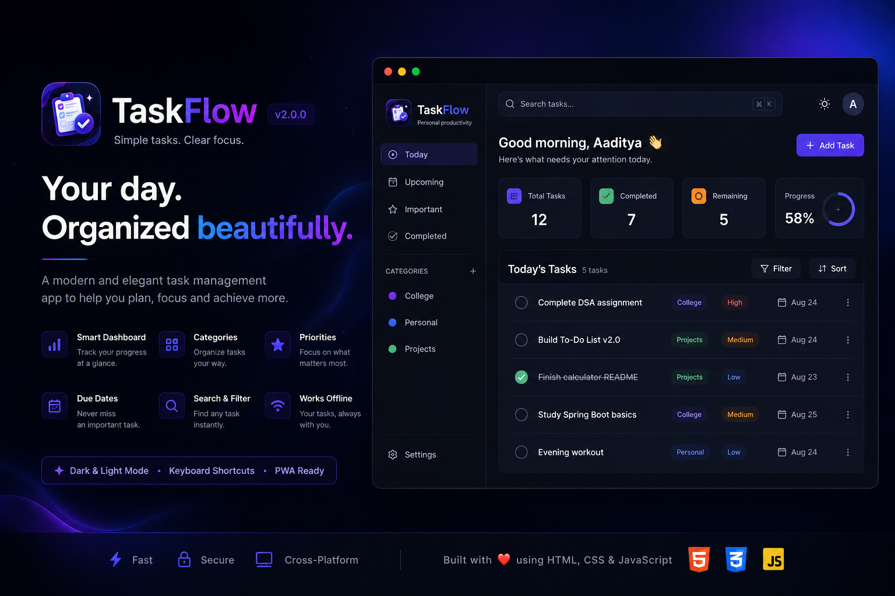

# 🚀 TaskFlow


---

<p align="center">
  
</p>

---

# 🌟 About The Project

**TaskFlow** is a modern, responsive task-management web application built with **HTML, CSS, and Vanilla JavaScript**.

The project was designed to provide a clean and practical way to create, organize, track, filter, and manage daily tasks directly in the browser.

TaskFlow focuses on:

- Clean and modern UI/UX
- Fast task management
- Local Storage persistence
- Categories and task organization
- Search and filtering
- Responsive design
- Keyboard-friendly interaction
- Accessible interface
- No framework dependency
- Simple and maintainable architecture

---

# 🌐 Live Demo

🚀 **Website**

Add your GitHub Pages URL here after deployment.

---

# ✨ Features

## 📝 Task Management

✔ Create new tasks

✔ Edit existing tasks

✔ Mark tasks as completed

✔ Delete tasks

✔ Restore and manage task state

✔ Persist tasks between browser sessions

---

## 🗂 Categories

✔ Organize tasks using categories

✔ Filter tasks by category

✔ Create and manage category-based task organization

✔ Persist category information locally

---

## 🔎 Search & Filters

✔ Search tasks quickly

✔ Filter by task status

✔ Filter by category

✔ Clear or reset filters

✔ Keep the task list focused and organized

---

## 💾 Local Storage

✔ Tasks are stored locally in the browser

✔ Categories are persisted locally

✔ Data remains available after refreshing the page

✔ No external database is required

✔ No account or backend is required

---

## 🎨 Design & UX

✔ Modern professional interface

✔ Responsive desktop and mobile layouts

✔ Clean typography and spacing

✔ Interactive buttons and controls

✔ Visual task states

✔ Smooth UI interactions

✔ Accessible focus states

✔ User-friendly empty states

---

# 🛠 Tech Stack

## Frontend


## Storage

Browser **Local Storage**

## Deployment


---

# 📂 Project Structure

```text
TaskFlow/

│
├── assets/
│   ├── css/
│   │   └── style.css
│   │
│   ├── js/
│   │   ├── app.js
│   │   └── utils.js
│   │
│   └── images/
│       ├── favicon.ico
│       ├── icon-192.png
│       ├── icon-512.png
│       └── preview.png
│
├── index.html
├── manifest.json
├── service-worker.js
├── README.md
├── CHANGELOG.md
├── LICENSE
└── .gitignore
```

> The exact contents of the `assets` directory may change as the project evolves. The structure above represents the main application architecture.

---

# 🚀 Installation & Setup

Clone the repository:

```bash
git clone https://github.com/Aadi6386/TaskFlow.git
```

Navigate into the project:

```bash
cd TaskFlow
```

## ▶ Run Locally

TaskFlow should be opened through a local HTTP server rather than directly using `file://`.

If Python 3 is installed:

```bash
python3 -m http.server 8000
```

Then open:

```text
http://localhost:8000
```

You can also use another local development server such as the **Live Server** extension in VS Code.

No framework or package installation is required.

---

# 📚 Learning Outcomes

Through this project, I improved my understanding of:

- HTML5 semantic structure
- CSS layout and responsive design
- JavaScript DOM manipulation
- Event handling
- Event delegation
- Form validation
- Local Storage
- Application state management
- Filtering and searching
- Dynamic UI rendering
- Accessibility
- Progressive Web App concepts
- Git and GitHub workflow
- GitHub Pages deployment
- Clean frontend architecture

---

# 🔄 Project Evolution

## 🚀 Version 2.0.0 — Major TaskFlow Redesign

A major transformation of the original task-management application into a modern, responsive, and portfolio-ready productivity application.

### Added

✨ Modern TaskFlow interface

✨ Task creation and editing

✨ Task completion management

✨ Task deletion

✨ Category-based organization

✨ Task filtering

✨ Search functionality

✨ Local Storage persistence

✨ Responsive design

✨ Modern UI components

✨ Improved accessibility

✨ PWA-ready application structure

### Improved

✔ Cleaner JavaScript architecture

✔ Better state management

✔ Improved task rendering

✔ Better responsive behaviour

✔ Improved user experience

✔ More maintainable project structure

---

## 🌱 Version 1.0.0 — Initial Release

The original TaskFlow application created as a frontend development project.

### Features

✔ Basic task creation

✔ Basic task completion

✔ Simple task interface

✔ Responsive layout

---

# 📅 Version History

| Version | Release | Description |
|---------|---------|-------------|
| 2.0.0 | 2026 | Major TaskFlow redesign |
| 1.0.0 | 2025 | Initial task-management application |

---

# 🛣 Future Improvements

Planned enhancements may include:

- 🗑️ Advanced category deletion and management
- 📅 Due dates and reminders
- ⭐ Task priorities
- 🔔 Notifications
- 📊 Productivity statistics
- 🔄 Drag-and-drop task ordering
- ☁️ Optional cloud synchronization
- 👤 User accounts
- 📱 Enhanced PWA functionality
- 🌙 Additional themes

---

# 📌 Project Status

🟢 **Active Development**

TaskFlow is being continuously improved as part of my frontend development journey.

---

# 👨‍💻 Author

## Aaditya Singh

🎓 B.Tech CSE Student

💻 Interested in:

- Web Development
- Java
- Data Structures & Algorithms
- Machine Learning

---

## 🌐 Connect With Me

[](https://www.linkedin.com/in/aaditya-singh-8349a6371/)

[](https://github.com/Aadi6386)

[](mailto:aadi6386@yahoo.com)

---

# ⭐ Support

If you like this project, consider giving the repository a ⭐.

It motivates me to continue learning, building, and improving open-source projects.

---

# 📜 License

This project is licensed under the **MIT License**.

See the `LICENSE` file for more information.

---

## ❤️ Thank you for visiting this repository!
